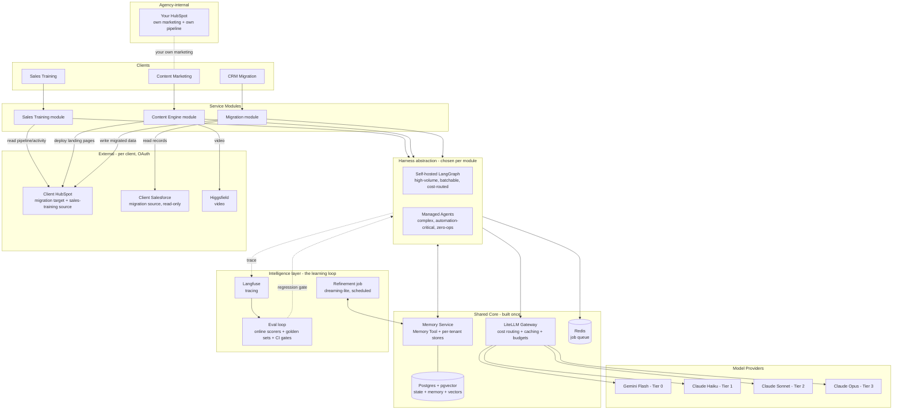
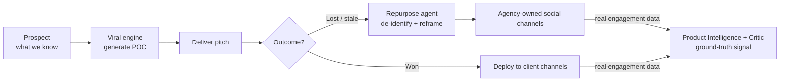

# AI Agency — Architecture Blueprint & Build Plan

**Owner:** Solo founder / CTO
**Last updated:** 2026-06-01 (v2 — intelligence layer added as day-1 structure)
**Purpose:** The operating architecture for a one-person AI agency running three service lines, designed to keep agent costs low, learn over time, and scale to a team without re-architecting.

---

## 1. Operating principle

> **One shared core, three thin service modules on top.**

Three business lines on three separate stacks will bury a solo operator in maintenance before the fifth client lands. Everything here flows from a single rule: build the expensive, load-bearing infrastructure **once**, and make each service line a thin module that calls it.

The three service lines:

1. **AI Sales Training** — analyse a client's HubSpot pipeline + activity data, generate playbooks and daily optimisation guidance for their sales team.
2. **AI Content Marketing** — the viral content engine + landing-page generation; copy, image, and video for brand launches.
3. **CRM Data Migration** — Salesforce → HubSpot mapping, transformation, validation.

> **Second principle — decouple memory, harness, and model.** These are three independent decisions. Memory lives on your own stack and is shared by everything. The harness (self-hosted vs managed) is chosen per module by economics. The model is routed per task by cost. Treating them as one bundle is how you overpay and lock yourself in. Build the *abstractions* day 1; default to the cheap implementation; reach for the managed/expensive one only where it pays.

---

## 2. Architecture diagram



> Rendering note: keep diagram exports on a white background with dark elements when producing PNGs from this.

---

## 3. The shared core (five pieces + observability)

A solo founder must be able to hold the entire core in their head. That is the constraint that keeps this maintainable.

| Layer | Tool | Role | Why this one |
|-------|------|------|--------------|
| Compute / deploy | **Render** | Web services, background workers, cron | Already in your stack; GitHub auto-deploy; no infra ops |
| Model gateway | **LiteLLM** (self-hosted on Render) | Single API in front of all models; cost tracking, per-client budgets, fallbacks, caching | The #1 cost lever; without it, model calls scatter with no cost visibility |
| Harness (default) | **LangGraph** | Self-hosted agent graphs, loops, conditional routing | Model-agnostic — preserves tiered cost routing + Batch. The default for high-volume work |
| Harness (selective) | **Claude Managed Agents** | Hosted runtime for complex, automation-critical modules | Zero-ops, fast to ship. $0.08/session-hr + standard tokens, no markup. Claude-locked, no Batch — use where ops time > token savings |
| Memory Service | **API Memory Tool + Postgres** | Cross-session memory, per-tenant, behind one interface | ~2,500 tokens overhead, no surcharge, model-agnostic. Real memory WITHOUT the managed premium |
| State + vectors | **Postgres + pgvector** (Render) | Structured state + vector store (hybrid search) | One DB does both — no separate vector bill |
| Queue | **Redis** (Render) | Background job queue for async/batch work | Decouples long agent runs from request cycle |
| Tracing | **Langfuse** (self-hosted on Render) | Agent tracing, token + latency analytics | Feeds the eval loop; LiteLLM shows cost, Langfuse shows *why* |
| Eval loop | **Braintrust or extended Langfuse** | Online scorers on live traces + offline golden sets + CI gates | The learning layer; your quality proof per client. See §5 |

**CRM topology — three distinct roles:**
1. **Your HubSpot (internal):** the agency's own CRM for your marketing and your own sales pipeline. Client work never touches it.
2. **Client HubSpot (external, per client, OAuth):** migration *destination*, sales-training data *source*, and landing-page deploy target.
3. **Client Salesforce (external, per client, OAuth):** migration *source* only — read-only, never written back.

Migration flow is **client Salesforce → client HubSpot**, never into your own portal.

---

## 4. The three service modules

Each module is a LangGraph app calling the shared core. They share the gateway, DB, queue, and observability — they differ only in their graph logic and external connections.

### 4.1 Sales Training module
- Connects to **client** HubSpot via OAuth (read pipeline, deals, activity).
- Analysis-heavy, low-volume → **cheap to run**. Mostly Tier 0–1.
- Output: playbooks + daily guidance delivered as HubSpot dashboards/reports.

### 4.2 Content Engine module — two flows, one engine
The viral engine (Research → Product Intelligence → Generate → Autonomous Critic → Novelty Check → Publish) serves two flows that share the same generation core. What differs is the input source and the downstream branch.

**Flow 1 — POC as sales motion.** Take what you know about a *prospect*, generate POC content, and deliver it as the pitch (finished, ready-to-ship — not live-published to their channels pre-contract). The pitch and its outcome are tracked as a deal in **your own HubSpot** pipeline.

**Flow 2 — Recycle lost pitches to owned channels.** When a pitch is lost or goes stale (N days no response), a HubSpot workflow fires the **Repurpose agent**: it de-identifies the prospect's brand and reframes the piece as an anonymized capability showcase, then deploys to the **agency's own social channels**.



- Claude writes copy → Gemini/Imagen images → Higgsfield video → landing pages deploy to the **client's** HubSpot CMS (confirm per client — may be their own site/host).
- **IP guardrail (non-negotiable):** the Repurpose agent de-identifies by default — strip the prospect's brand, trademarks, and product specifics; reframe as anonymized showcase. Never post a lost prospect's branded content as your own.
- **Most expensive module** (video) → strictest cost discipline. Caching + batch are critical here.
- **The flywheel:** owned-channel posts return real engagement (views, watch-time, shares) — ground-truth that feeds the eval loop, so the system learns what actually goes viral per category instead of relying on LLM-judge guesses. See §5.3.

### 4.3 CRM Migration module
- Maps **client Salesforce → client HubSpot** (read-only on Salesforce, write to the client's new HubSpot portal — never your own).
- Plugs in the existing `hubspot-crm-architect` skill (natural keys, snake_case conventions, association-first design, BVA SQL patterns).
- High record volume, simple per-record work → **cheapest tier + batch processing**.

### 4.4 Agent inventory (~15 agents)
Infrastructure (LiteLLM, MemoryService, Harness, Postgres, Langfuse) is **not** an agent — only things that reason count.

| Tier | Agents |
|------|--------|
| **Service (client-facing) — 3** | Sales Training · Content Marketing · CRM Migration |
| **Specialist sub-agents — ~10** | *Content:* Research, Product Intelligence, Content Generator, Autonomous Critic, Novelty Check, **Repurpose (de-identify + reframe lost pitches)** · *Sales:* Pipeline Analyzer, Playbook Generator · *Migration:* Schema Mapper, Transform & Validate |
| **System (background) — 2** | Refinement ("dreaming-lite") · Evaluator (LLM-judge) |

The Social Publisher (posting/scheduling to owned channels) is a **tool**, not an agent. A client experiences *one* agent; behind it an orchestrator delegates to specialists, each with a narrow job and clean context. Sales and Migration will each likely add a sub-agent as they mature (e.g. a post-migration reconciliation agent).

---

## 5. Intelligence layer — the learning loop (built day 1)

This is what separates "runs agents" from a SMART, contextualised system you sell to companies. Three decoupled pieces, all built behind clean interfaces from the start.

### 5.1 Memory architecture (your own stack, not Managed Agents)
Real cross-session memory does **not** require Managed Agents. Use the **API Memory Tool** (`memory_20250818`: view/create/str_replace/insert/delete/rename, ~2,500 tokens overhead, no surcharge) backed by per-tenant Postgres stores. Wrap it in a `MemoryService` interface so the backend is swappable.

```python
class MemoryService:
    def write(self, client_id, module, content, metadata): ...   # extractive: store what's worth keeping
    def read(self, client_id, module, query): ...                # hybrid: keyword + semantic
    def search(self, client_id, query, k=5): ...                 # pgvector cosine + FTS
```

- **Extractive, not dump-everything** — the agent decides what's worth remembering; routine work isn't retained.
- **Per-tenant isolation** — `client_id` scopes every read/write; this is your contextualisation engine.
- **Replaces `feedback_log.json`** — the flat file becomes a real, queryable store.

### 5.2 Self-improvement — "dreaming-lite" now, Dreaming later
Anthropic's **Dreaming** (agents auto-review past sessions and refine memory) is invitation-only developer preview as of May 2026 and uses a cheap advisor/executor billing model. Don't wait on it:
- **Now:** a scheduled **refinement job** runs nightly on Haiku — reorganises and distils each client's memory store, promotes recurring patterns, prunes noise. Pennies per run.
- **Later:** swap the job's implementation for real Dreaming behind the same interface when access opens.
- **Self-reflecting skills:** add a reflection hook after skill invocation that extracts corrections and updates the `SKILL.md` with confidence levels. Per-client Encoded-Preference skills then compound.

### 5.3 Evaluation loop (your quality proof per client)
Tracing shows *what* happened; evals show whether it was *good*. The pattern:
- **Offline:** golden dataset per client; run before any deploy.
- **Online:** LLM-as-judge scorers attached to live production traces; quality regressions surface as they happen.
- **CI gate:** block merges that degrade scores.
- **Feedback loop:** production failures auto-curate back into the golden set.
- **Real-engagement ground truth:** owned-channel posts (recycled lost pitches, see §4.2) return actual views/watch-time/shares. Feed this back as the strongest eval signal — it upgrades the Critic and Product Intelligence agents from *guessing* virality to *knowing* it per category. This is the flywheel that LLM-judge-only systems never get.
- Run cheap heuristic checks on 100% of traffic, expensive judge scoring on a 5–10% sample.

### 5.4 Harness routing rule (when to use Managed Agents)
Decide per module by economics, not hype:

| Use **self-hosted LangGraph** when… | Use **Managed Agents** when… |
|---|---|
| High volume / batchable (migration record transforms, content classification) | Low volume, complex, long-running sessions |
| Cost-sensitive — needs Tier-0/1 routing to Gemini/Haiku | Automation-critical — ops time matters more than token cost |
| You want the 50% Batch discount (not available in Managed Agents) | You want zero infra, built-in checkpointing/recovery, fast ship |
| Model-agnostic required | Claude-native is fine |

Rule of thumb: **default to self-hosted; promote a module to Managed Agents only when the ops burden of running it yourself exceeds the token premium.** Both call the same `MemoryService` and emit the same eval traces — the harness is swappable.

---

## 6. Cost control — the four levers

### Lever 1 — Tiered model routing (60–80% savings, biggest lever)
Every task declares its difficulty; LiteLLM routes to the cheapest model that clears the bar. Default to the lowest tier; escalate only when an output quality check fails.

| Tier | Model | Use for |
|------|-------|---------|
| 0 | Gemini Flash | Classification, extraction, image understanding, simple Q&A |
| 1 | Claude Haiku | Structured tasks, record transformation, moderate reasoning |
| 2 | Claude Sonnet | Most generation, copywriting, agent orchestration |
| 3 | Claude Opus / Gemini Pro | Hard reasoning, complex migration logic — rare, deliberate |

### Lever 2 — Prompt caching (up to ~90% off repeated input)
Cache static prefixes: system prompts, brand profiles, knowledge bases. Huge for the content engine, where the same brand profile feeds every concept.

### Lever 3 — Batch processing (50% off)
Anything non-realtime — overnight content runs, bulk migration jobs — goes through batch APIs. Treat realtime as the exception, not the default.

### Lever 4 — Cache outputs, don't regenerate
`product_intelligence.json` per SKU, brand profiles, field mappings, style decisions — compute once, store in Postgres, reuse. Regenerating unchanged artifacts is pure waste.

**Not yet:** self-hosting models on GPU (NVIDIA NIM). Ops overhead isn't worth it at solo / early volume. Revisit only when a single high-volume task dominates the bill — a "good problem" milestone.

---

## 7. Multi-tenant data model

Build multi-tenant from day one. Every table carries `client_id`; every agent run is scoped to a tenant. Onboarding client #20 is a row, not a deployment.

```sql
-- Tenancy
CREATE TABLE clients (
    id              UUID PRIMARY KEY DEFAULT gen_random_uuid(),
    name            TEXT NOT NULL,
    service_lines   TEXT[] NOT NULL,        -- {sales_training, content, migration}
    hubspot_portal  TEXT,                   -- OAuth-linked portal id
    monthly_budget  NUMERIC,                -- USD cap enforced via LiteLLM
    created_at      TIMESTAMPTZ DEFAULT now()
);

-- Every agent run, scoped + costed
CREATE TABLE agent_runs (
    id           UUID PRIMARY KEY DEFAULT gen_random_uuid(),
    client_id    UUID NOT NULL REFERENCES clients(id),
    module       TEXT NOT NULL,             -- sales_training | content | migration
    status       TEXT NOT NULL,             -- queued|running|done|failed
    input        JSONB,
    output       JSONB,
    token_cost   NUMERIC,                   -- pulled from LiteLLM
    model_tier   INT,
    created_at   TIMESTAMPTZ DEFAULT now()
);

-- Reusable cached artifacts (product intelligence, brand profiles, mappings)
CREATE TABLE artifacts (
    id           UUID PRIMARY KEY DEFAULT gen_random_uuid(),
    client_id    UUID NOT NULL REFERENCES clients(id),
    kind         TEXT NOT NULL,             -- product_intelligence|brand_profile|field_map
    key          TEXT NOT NULL,             -- e.g. sku id
    data         JSONB NOT NULL,
    valid_until  TIMESTAMPTZ,               -- cache expiry; NULL = until inputs change
    UNIQUE (client_id, kind, key)
);

-- Memory / RAG (one DB, no separate vector store)
CREATE TABLE memory (
    id           UUID PRIMARY KEY DEFAULT gen_random_uuid(),
    client_id    UUID NOT NULL REFERENCES clients(id),
    module       TEXT NOT NULL,
    content      TEXT NOT NULL,
    embedding    VECTOR(1536),
    metadata     JSONB,
    created_at   TIMESTAMPTZ DEFAULT now()
);
CREATE INDEX ON memory USING ivfflat (embedding vector_cosine_ops);
```

Keep agent workers **stateless** — all state lives in Postgres/Redis. That is what lets Render scale workers horizontally under load.

**Prospects & pitch provenance.** Prospects and pitch outcomes live in **your own HubSpot** pipeline (a prospect is a deal; won/lost/stale are stages; a workflow fires the Repurpose branch on loss). Postgres only needs a lightweight link so generated content knows its origin and can receive engagement data back: tag each content artifact with `origin` (`prospect` | `client`), the `pitch_id`/`hubspot_deal_id`, and `deploy_target` (`prospect` | `client_channel` | `owned_channel`). That tag is what routes the repurpose branch and ties owned-channel engagement back to the eval loop.

---

## 8. LiteLLM routing config (starting point)

```yaml
# litellm config.yaml
model_list:
  - model_name: tier-0
    litellm_params: { model: gemini/gemini-flash }
  - model_name: tier-1
    litellm_params: { model: anthropic/claude-haiku-4-5 }
  - model_name: tier-2
    litellm_params: { model: anthropic/claude-sonnet-4-6 }
  - model_name: tier-3
    litellm_params: { model: anthropic/claude-opus-4-8 }

router_settings:
  fallbacks:
    - tier-0: [tier-1]
    - tier-2: [tier-3]
  enable_caching: true

general_settings:
  max_budget_per_key: true   # enforce per-client monthly_budget
```

> Verify exact model strings against current provider docs at build time.

---

## 9. Scalability principles (so growth ≠ rewrite)

1. **Multi-tenant from day one** — `client_id` on every table; runs scoped to tenants.
2. **Stateless workers** — state in Postgres/Redis, never in the worker; scale horizontally.
3. **Independent modules on a shared core** — adding a 4th service line (or handing a module to your first hire) is additive, never a teardown.

---

## 10. Tooling decisions & rejected alternatives

Documented so future-you (or a first hire) doesn't relitigate these every six months.

| Tool | Verdict | Reasoning |
|------|---------|-----------|
| **OpenAI Codex / Claude Code** | Adopt — dev toolchain | Tools to *build* the agency faster. Never production runtime. |
| **Claude Agent SDK** | Adopt — sub-component | Excellent for Claude-native modules (migration, MCP-heavy). Not the top orchestrator: Claude-locked, would break tiered routing. LangGraph sits above it. |
| **Claude Managed Agents** | Adopt — selective harness | $0.08/session-hr + standard tokens, no markup, idle free. Use for complex/automation-critical modules where ops time beats token savings. Not for batchable high-volume work (no Batch API; Claude-locked). |
| **API Memory Tool** | Adopt — memory backbone | Real cross-session memory on your own stack, ~2,500 tokens, no surcharge, model-agnostic. Chosen over Managed Agents memory to avoid premium + lock-in. |
| **Dreaming** | Watch — invite-only preview | Self-improving memory; cheap advisor/executor billing. Build "dreaming-lite" (scheduled Haiku refinement) now; swap in when access opens. |
| **Obsidian** | Adopt — internal only | Your knowledge substrate: SOPs, client notes, Agent Skill authoring (markdown-native). NOT a client-facing multi-tenant backend — that's Postgres. |
| **OpenClaw** | Optional — edge / demos | Good as your *personal* operator interface (ops summaries to WhatsApp) and fast prospect demos. Security profile + personal-assistant shape disqualify it as the production core. |
| **Gemini Spark** | Reject | Closed consumer product, no API, can't be multi-tenant or billed against. Subscribe personally if useful; not a business component. |

**Principle:** sort tools by *which layer of the business they serve*, not by hype. "Makes me faster" (dev/personal tools) has a far lower reliability/security bar than "load-bearing infrastructure clients depend on." The core is the load-bearing layer.

---

## 11. Getting started — task list

Restructured so the **abstractions** (memory, harness, eval) go in from day 1 — get the structure right first, default to cheap implementations, promote to managed/expensive only where it pays.

### Phase 0 — Foundations & interfaces (Week 1) — *the day-1 structure*
- [ ] Stand up LiteLLM as a Render web service; define tier-0 → tier-3 models, fallbacks, prompt caching
- [ ] Provision Render Postgres (`pgvector`) + Redis
- [ ] Create schema: `clients`, `agent_runs`, `artifacts`, `memory` (all `client_id`-scoped)
- [ ] Define the three interfaces as code stubs: `MemoryService`, `Harness`, `Evaluator` — implementations come next, but everything is built against these from now on
- [ ] Self-host Langfuse; wire tracing into the `Harness` interface

### Phase 1 — Memory + cost backbone (Week 1–2)
- [ ] Implement `MemoryService` on the API Memory Tool + Postgres (write/read/search, hybrid retrieval)
- [ ] Migrate `feedback_log.json` into the per-tenant memory store
- [ ] Point the existing content pipeline's model calls at LiteLLM; confirm per-call cost is visible
- [ ] Default-tier + escalation rule (start tier-0, escalate on quality-check fail)

### Phase 2 — Content engine → autonomous agent on the harness (Weeks 2–3)
- [ ] Implement `Harness` with the self-hosted LangGraph backend first
- [ ] Build the content graph: research quality gate → Product Intelligence → generate → autonomous critic (6 dims) → novelty check → publish
- [ ] All nodes read/write via `MemoryService`; all runs emit traces via the `Harness`
- [ ] Wire async "what was posted" notification (OpenClaw or webhook)

### Phase 3 — Eval loop (Weeks 3–4) — *the learning layer*
- [ ] Implement `Evaluator`: offline golden set for the content module + online LLM-judge scorers on live traces
- [ ] Add the CI gate (block deploys that regress scores)
- [ ] Wire production failures back into the golden set
- [ ] Add the nightly "dreaming-lite" refinement job (Haiku reorganises each client's memory store)

### Phase 4 — Second harness + remaining modules
- [ ] Add the Managed Agents backend to the `Harness` interface
- [ ] **Sales Training:** HubSpot OAuth → pipeline read → playbook graph → HubSpot dashboards (self-hosted harness)
- [ ] **CRM Migration:** Salesforce read → mapping graph (`hubspot-crm-architect` skill) → validation → HubSpot write, via Batch (self-hosted harness)
- [ ] Promote any complex/automation-critical module to Managed Agents per the §5.4 rule
- [ ] Enforce `monthly_budget` per client via LiteLLM keys
- [ ] Set up your own agency pipeline in HubSpot (dogfood + demo)

### Phase 5 — Internal ops & knowledge (ongoing)
- [ ] Obsidian vault as knowledge substrate (SOPs, client notes, skills)
- [ ] Author Agent Skills as markdown; add reflection hooks so they self-update
- [ ] Weekly steering ritual: 3–5 lines per client into the memory store (what's working / drifting / brand notes)

---

## Definition of done (early milestones)
- **Interfaces first:** every agent call goes through `MemoryService`, `Harness`, and `Evaluator` — no direct model/memory calls anywhere.
- **Cost visible:** every model call shows tier + cost in LiteLLM.
- **Memory works:** an agent recalls a prior-session fact for the right client and ignores other tenants'.
- **Content runs unattended:** full run completes start-to-publish with no human, publishing only above the eval threshold.
- **Quality is provable:** a client's golden set runs in CI and blocks a regression.
- **Multi-tenant proven:** two clients run isolated, each with an enforced budget cap.
